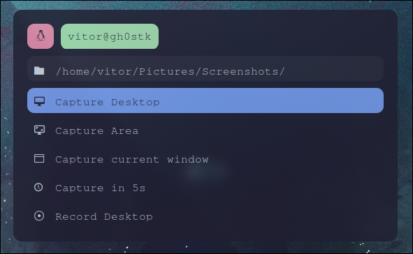

# Screenshot & Screen Recording Tool

This is a Bash script for taking screenshots and recording videos using Rofi as a graphical interface on Linux systems with Wayland (specifically for Hyprland).

## Features

- Fullscreen screenshot  
- Select area screenshot  
- Active window screenshot  
- Delayed screenshot (5 seconds)  
- Fullscreen screen recording  
- Select area screen recording  
- Stop ongoing recording  

## Dependencies

- rofi  
- grim (for taking screenshots)  
- slurp (for selecting areas)  
- wf-recorder (for screen recording)  
- jq (for handling JSON)  
- notify-send (for notifications)  

## Installation

1. Clone this repository:  
```bash
git clone https://github.com/viitorags/rofi-screenshots-script.git
```

2. Make the script executable:

```bash
chmod +x screenshot.sh
```

3. Copy the theme file to the Rofi configuration directory:

```bash
cp screenshot.rasi ~/.config/rofi/
```

## Usage

Run the script:

```bash
./screenshot.sh
```

Or bind it to a keyboard shortcut in your desktop environment for easy access.

## Screenshots
<div align="center">
    
</div>
